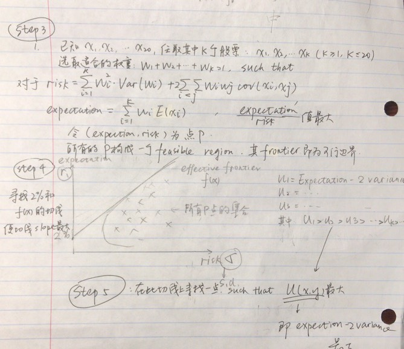

# 策略

## 构建股票池

**聚焦于行业板块，在每个行业板块中通过因子指标的交集选取出6支股票，再平衡周期为10日。**

**行业板块：**保险、农业、半导体、生物科技、工程机械、银行

（依据：Wind数据提供的近三年涨幅排序靠前的行业）

**因子**：市净率+市值+动量

（依据：课程第二讲中A股表现较优的因子）

**具体指标：**

市净率（P/B）：

选取市净率为1-10的股票

市值：

剔除市值排序后10%的股票（去除小市值股票）

动量:

选出10日跌幅前10%的股票

**代码参考**：第四讲股票池代码


#### 实现描述

> 以10天为周期
>
> 分别在六个行业板块中
> 	选取 {市净率为1-10}∩{市值在前90%}∩{十日跌幅前10%(历史行情数据)} 的6只(or 所有)股票
> 	将上述股票加入股票池
>
>  
>
> 约定接口
>
> 调用一次返回一个股票池的list/dataframe/series
>
> 10天的周期不在本函数体现


##投资策略（资金分配）

投资策略（资金分配）

优先选择：投资学的方法（的改编版）

1）选取（已经被挑选出来的）投资标的的股票，计算其预期收益率（按照过往的平均收益率来预测）和预期波动率（过往数据）

2）计算二者间的任意二者之间的covariance，形成协方差矩阵

3）构成feasible frontier：对于某一波动率（风险）而言，这些股票所能构成的最小及最大的收益。

在群里的图中，我们已经构建了各种点P，现在寻找sharpe ratio最大的P，也就是expectation/s.d.最大的那个P点。这个P点所含的投资组合即为投资组合的分析权重。



参考：[https://www.jianshu.com/p/4cc811402477#4.3-%E5%A4%8F%E6%99%AE%E6%9C%80%E4%BC%98%E7%BB%84%E5%90%88](https://www.jianshu.com/p/4cc811402477#4.3-夏普最优组合)


## 择时

### 逻辑

利用EXPMA均线来控制入场出场时机，

>EXPMA=（当日或当期收盘价－上一日或上期EXPMA）/N+上一日或上期EXPMA
>
>其中，首次上期EXPMA值为上一期收盘价，N为天数。

20分钟K线，配合3日（或5日）EXPMA和20日（或30日）EXPMA，可以分组测算效果


可参考：

https://www.joinquant.com/view/community/detail/bc77d33ac2da40cea5702f944e708ef2?type=1

https://www.joinquant.com/view/community/detail/f96dab853be1784069c3bd9e30c162e6?type=1

#### 实现描述


```
每日运行

开盘前：
	构建股票池（如果股票池更新，那么开盘时将之前的持仓空仓卖出）
	如果更新了股票池，则对该股票池计算资金分配比例
	
盘中：
	如果股票池有更新
		空仓卖出
	如果短线上穿长线
		利用所有剩下的资金按分配买入股票
	如果短线下穿长线
		空仓卖出
	否则不操作
	
	
构建股票池#
计算资金分配####（待修改）
计算买入/卖出信号(包含EMA)###
买入操作#
```


